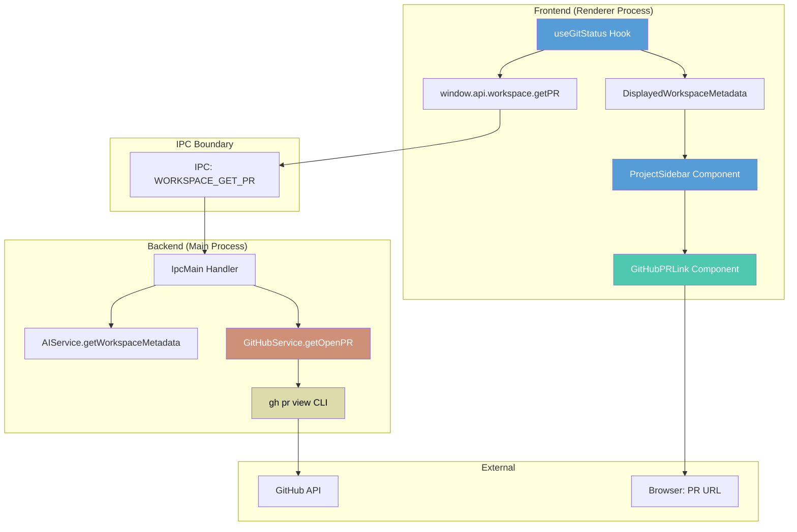

# GitHub PR Link Feature Implementation

## Summary

Added functionality to detect and display a GitHub PR link in the workspace sidebar when a workspace has an open pull request.

## Changes Made

### 1. Backend: GitHub Service (`src/services/githubService.ts`)
- **New file**: Created `GitHubService` class to interact with GitHub CLI
- Checks if `gh` CLI is available on the system
- Fetches PR information for the current branch using `gh pr view --json number,title,url,state`
- Returns `PullRequestInfo` or `null` if no PR exists or `gh` is unavailable
- Gracefully handles errors with debug logging

### 2. Types (`src/types/workspace.ts`)
- **Added** `PullRequestInfo` interface:
  - `number`: PR number
  - `title`: PR title
  - `url`: PR URL
  - `state`: "OPEN" | "CLOSED" | "MERGED"
- **Extended** `DisplayedWorkspaceMetadata` to include `pullRequest: PullRequestInfo | null`

### 3. IPC Layer
- **IPC Constants** (`src/constants/ipc-constants.ts`):
  - Added `WORKSPACE_GET_PR` channel
- **IPC Types** (`src/types/ipc.ts`):
  - Added `getPR(workspaceId: string): Promise<PullRequestInfo | null>` to `IPCApi.workspace`
- **Preload** (`src/preload.ts`):
  - Implemented `getPR` method that invokes `WORKSPACE_GET_PR` channel
- **IPC Main** (`src/services/ipcMain.ts`):
  - Added `GitHubService` instance to `IpcMain` class
  - Registered handler for `WORKSPACE_GET_PR` that:
    - Gets workspace metadata
    - Calls `githubService.getOpenPR()` with workspace path
    - Returns PR info or null

### 4. Frontend: Data Fetching (`src/hooks/useGitStatus.ts`)
- **Extended** `useGitStatus` hook to fetch PR information alongside git status
- Polls for PR info every 1 second (same interval as git status)
- Initializes `pullRequest: null` for all workspaces
- Calls `window.api.workspace.getPR(metadata.id)` for each workspace
- Updates `DisplayedWorkspaceMetadata` with PR info

### 5. Frontend: UI Component (`src/components/GitHubPRLink.tsx`)
- **New file**: Created `GitHubPRLink` component
- Displays GitHub logo icon (SVG) when PR exists
- Styled button with hover effects
- Tooltip shows "PR #123: Title"
- Clicking opens PR URL in external browser via `window.open(url, "_blank")`
- Uses `TooltipWrapper` for consistent tooltip behavior

### 6. Frontend: Integration (`src/components/ProjectSidebar.tsx`)
- **Imported** `GitHubPRLink` component
- **Added** conditional rendering after `GitStatusIndicator`:
  ```tsx
  {metadata.pullRequest && <GitHubPRLink pullRequest={metadata.pullRequest} />}
  ```
- Icon appears inline with other workspace indicators

## User Experience

1. **Detection**: System automatically checks for open PRs every 1 second
2. **Display**: GitHub logo appears next to workspace name when PR exists
3. **Interaction**: Hovering shows PR number and title in tooltip
4. **Action**: Clicking opens the PR in the default web browser

## Requirements

- GitHub CLI (`gh`) must be installed and authenticated
- The workspace branch must have an associated PR
- PR must be in "OPEN" state to be displayed

## Error Handling

- Gracefully handles missing `gh` CLI (returns null)
- Handles workspaces without PRs (returns null)
- Handles closed/merged PRs (only shows open PRs)
- Errors logged at debug level, don't crash the UI

## Performance

- PR detection runs alongside existing git status polling (1 second interval)
- Uses existing workspace metadata fetch infrastructure
- No additional IPC overhead beyond the PR check itself

## Architecture Diagram



## Data Flow

1. **Poll Cycle** (every 1 second):
   - `useGitStatus` fetches git status for all workspaces
   - For each workspace, calls `window.api.workspace.getPR(workspaceId)`

2. **IPC Request**:
   - Preload forwards to main process via `WORKSPACE_GET_PR` channel
   - IpcMain handler receives workspaceId

3. **Backend Processing**:
   - Get workspace metadata to obtain `workspacePath`
   - `GitHubService.getOpenPR(workspacePath)` executes `gh pr view --json number,title,url,state`
   - Parses JSON response and returns only OPEN PRs

4. **Frontend Update**:
   - `useGitStatus` updates `DisplayedWorkspaceMetadata` with PR info
   - React re-renders workspace items
   - `ProjectSidebar` conditionally renders `GitHubPRLink` if PR exists

5. **User Interaction**:
   - User clicks GitHub icon
   - `window.open(url, "_blank")` triggers
   - Electron's `setWindowOpenHandler` opens URL in default browser

