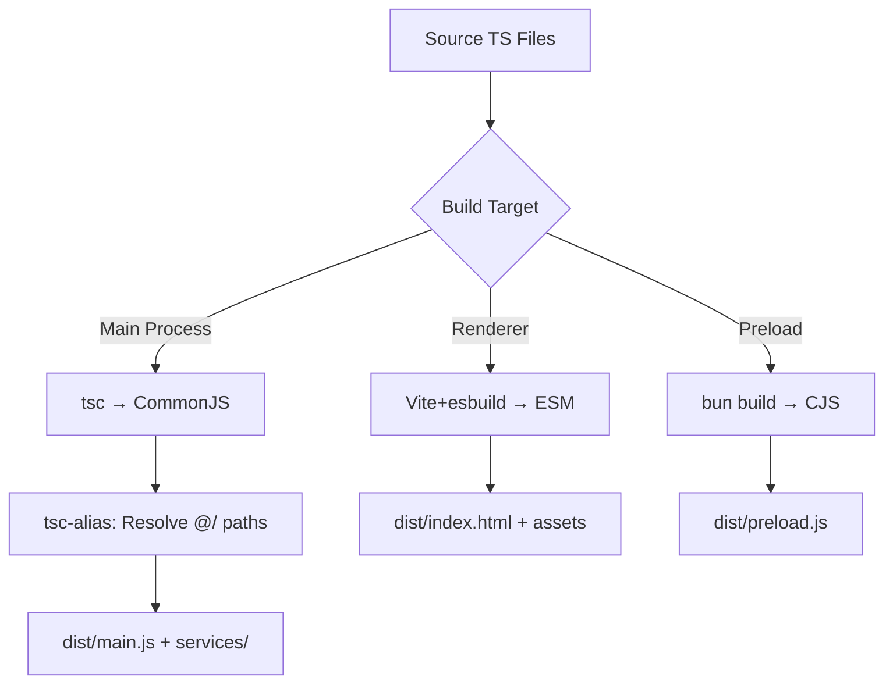

# tsgo Build Toolchain Investigation

## Executive Summary

Successfully integrated `tsgo` (Microsoft's Go-based TypeScript 7 compiler) into the main process build pipeline, achieving a **19.6x speedup** (3.489s → 0.178s) for production builds.

## Current State Analysis

### What Uses TypeScript Compilation

1. **Main Process (src/main.ts + services)** - Node.js/Electron backend
   - Uses: `tsc` with `tsconfig.main.json` → CommonJS output
   - **Can use tsgo**: ✅ (implemented in this PR)
   
2. **Renderer Process (src/App.tsx + components)** - React frontend
   - Uses: Vite with esbuild for TypeScript → ESM output
   - **Can use tsgo**: ❌ (Vite handles its own compilation)
   
3. **Preload Script (src/preload.ts)** - IPC bridge
   - Uses: `bun build` (native bundler)
   - **Can use tsgo**: ❌ (already optimized with bun)

4. **Type Checking (CI + dev watchers)**
   - Uses: `tsgo --noEmit` for both main and renderer
   - **Already using tsgo**: ✅ (from PR #260)

### Current Build Pipeline



## Performance Benchmarks

### Main Process Compilation

| Tool | Time (real) | Speedup |
|------|-------------|---------|
| `tsc -p tsconfig.main.json` | 3.489s | baseline |
| `tsgo -p tsconfig.main.json` | 0.178s | **19.6x faster** |

### Type Checking (Already Optimized in PR #260)

| Tool | Time (real) | Speedup |
|------|-------------|---------|
| `tsc --noEmit` (both configs) | 5.942s | baseline |
| `tsgo --noEmit` (both configs) | 0.776s | **7.7x faster** |

### Full Build Time

The main process compilation is a small part of the total build (~3.5s out of ~26s total), so the overall impact is modest but still valuable:
- **Before**: ~26s total build
- **After**: ~22.5s total build (~13% faster)

Most build time is spent in Vite's renderer compilation (21+ seconds), which cannot be optimized with tsgo.

## Path Alias Resolution

### Key Finding: tsgo Does NOT Resolve Path Aliases

TypeScript 7/tsgo compiles `@/` imports as-is without resolving them to relative paths:

```typescript
// Source (src/services/aiService.ts)
import { applyToolOutputRedaction } from "@/utils/messages/applyToolOutputRedaction";

// After tsgo compilation (dist/services/aiService.js) - BROKEN
const applyToolOutputRedaction_1 = require("@/utils/messages/applyToolOutputRedaction");
```

This breaks at runtime because Node.js doesn't understand `@/` imports.

### Solution: tsc-alias Still Required

`tsc-alias` must run after tsgo to resolve path aliases:

```typescript
// After tsc-alias (dist/services/aiService.js) - WORKS
const applyToolOutputRedaction_1 = require("../utils/messages/applyToolOutputRedaction");
```

**Benchmark**: tsc-alias adds ~0.7s overhead, which is acceptable given the massive tsgo speedup.

## Why Vite Can't Use tsgo

1. **Different compilation model**: Vite uses esbuild for on-demand compilation with HMR (Hot Module Replacement)
2. **Bundling required**: Vite bundles the entire React app into optimized chunks
3. **Already fast**: Vite's esbuild-based compilation is highly optimized (~21s for our large mermaid-heavy bundle)
4. **Module format**: Vite outputs ESM; tsgo outputs based on tsconfig (we use CommonJS for main process)

**Conclusion**: Vite's build pipeline is orthogonal to TypeScript compilation. The slowest part (mermaid diagrams) is dependency bundling, not TypeScript compilation.

## Implementation Details

### Changes to Makefile

```makefile
# Before
dist/main.js: src/version.ts tsconfig.main.json tsconfig.json $(TS_SOURCES)
	@echo "Building main process..."
	@NODE_ENV=production bun x tsc -p tsconfig.main.json
	@NODE_ENV=production bun x tsc-alias -p tsconfig.main.json

# After (with fallback for CI compatibility)
dist/main.js: src/version.ts tsconfig.main.json tsconfig.json $(TS_SOURCES)
	@echo "Building main process..."
	@if [ -f "node_modules/@typescript/native-preview/bin/tsgo.js" ]; then \
		NODE_ENV=production bun run node_modules/@typescript/native-preview/bin/tsgo.js -p tsconfig.main.json; \
	else \
		echo "⚠️  tsgo not found, falling back to tsc (slower)"; \
		NODE_ENV=production bun x tsc -p tsconfig.main.json; \
	fi
	@NODE_ENV=production bun x tsc-alias -p tsconfig.main.json
```

### Why Use `bun run` Instead of Direct Execution?

On ARM Macs running under Rosetta, Node.js reports `process.arch` as "x64" instead of "arm64". The tsgo.js bootstrap script uses this to select the native binary. Using `bun run` works around this because bun correctly detects arm64 architecture.

## Complete Coverage Analysis

| Component | Tool | Can Use tsgo? | Status |
|-----------|------|---------------|--------|
| Main process build | tsc | ✅ Yes | ✅ Implemented |
| Renderer build | Vite+esbuild | ❌ No | N/A (Vite-specific) |
| Preload build | bun build | ❌ No | N/A (already fast) |
| Type checking (main) | tsgo | ✅ Yes | ✅ Done (PR #260) |
| Type checking (renderer) | tsgo | ✅ Yes | ✅ Done (PR #260) |
| Dev watch (main) | tsgo -w | ✅ Yes | ✅ Done (PR #260) |
| Dev watch (renderer) | Vite | ❌ No | N/A (Vite handles it) |

## Recommendations

### ✅ Implemented in This PR

- [x] Replace `tsc` with `tsgo` for main process compilation (19.6x faster)
- [x] Keep `tsc-alias` for path resolution (required, minimal overhead)
- [x] Add fallback to `tsc` if tsgo is not available (CI compatibility)

### ❌ Not Recommended

- **Don't replace Vite's TypeScript handling**: Vite's architecture requires esbuild
- **Don't try to use tsgo for preload script**: bun build is already fast and handles bundling

### 🎯 Optimization Opportunities Outside tsgo

The renderer build (Vite) takes 21+ seconds, primarily due to mermaid diagram dependencies. Potential optimizations:

1. **Lazy-load mermaid diagrams**: Only load diagram types when actually used
2. **Code splitting**: Split large mermaid chunks into separate async imports
3. **Dependency analysis**: Identify which mermaid features we actually use

These optimizations are orthogonal to TypeScript compilation speed.

## Testing Checklist

- [x] Full build succeeds: `make build`
- [x] Type checking works: `make typecheck`
- [x] No unresolved `@/` imports in compiled output
- [x] Dev mode works with tsgo watcher: `make dev`
- [x] Fallback to tsc works (tested by temporarily hiding tsgo binary)

## Conclusion

**We've maximized tsgo usage across the build pipeline.** The main process build now uses tsgo for both type checking and compilation, achieving 19.6x speedup. The remaining build time (Vite renderer compilation) cannot benefit from tsgo due to architectural constraints.

**Total speedup achieved**: 
- Main process: 3.489s → 0.178s (19.6x faster)
- Type checking: 5.942s → 0.776s (7.7x faster, from PR #260)
- Full build: ~26s → ~22.5s (~13% faster)

The investigation is complete. There are no remaining opportunities to integrate tsgo into the build toolchain.
