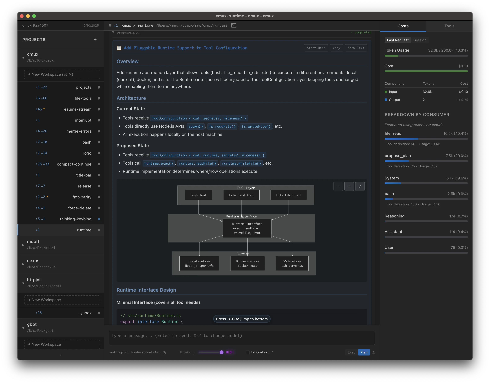

# cmux - coding agent multiplexer

A cross-platform desktop application for parallel agentic development.

Why parallelize?

Here are some specific use cases we enable:

- **Contextual continuity between relevant changes**:
  - e.g. create a workspace for `code-review`, `refactor`, and `new-feature`
- **GPT-5-Pro**: use the slow but powerful GPT-5-Pro for complex issues
  - Run in the background for hours on end
  - The stream will automatically resume after restarts or intermittent connection issues. If the model completes early we will show an indicator.
- **A/B testing**: run multiple workspaces in parallel on the same problem but different approaches,
  abandon the bad ones.
- **Tangent exploration**: launch tangents in `cmux` away from main work

## Features

- Isolated workspaces with central view on git status updates
- Multi-model (`sonnet-4-*`, `gpt-5-*`, `opus-4-*`)
- Supporting UI and keybinds for efficiently managing a suite of agents
- Rich markdown outputs (mermaid diagrams, LaTeX, etc.)

`cmux` has a custom agent loop, but, we are heavily inspired by Claude Code in our
UX. You'll find familiar features like Plan/Exec mode, VIM inputs, `/compact` and new ones
like [opportunistic compaction](https://cmux.io/context-management.html) and [mode prompts](https://cmux.io/instruction-files.html#mode-prompts).

📚 **[Read the full documentation →](https://cmux.io)**

## Quick Install

Download pre-built binaries from [the releases page](https://github.com/coder/cmux/releases):

- **macOS**: Signed and notarized DMG (separate builds for Intel/Apple Silicon)
- **Linux**: AppImage
- **Windows**: not implemented, coming soon

## Screenshots

> Mermaid diagrams make it easier to review complex proposals from the Agent

## Development

See [AGENTS.md](./AGENTS.md) for development setup and guidelines.
