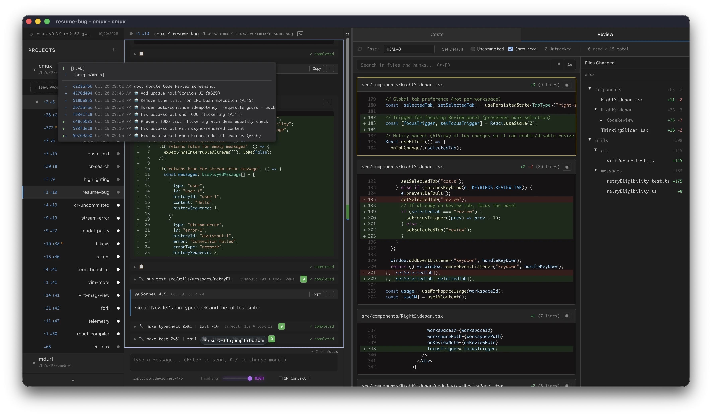

# cmux - coding agent multiplexer

A cross-platform desktop application for parallel agentic development.

## Features

The overall experience should be familiar to Claude Code power users, we strive for parity with the best parts of Claude Code:

- Plan/Exec modes
- `/compact` based manual compaction
- vim mode in input box

But, the agentic loop is custom. Our goal is to create an experience that is as immersive and rich as an IDE. In fact, we think
of cmux as the IDE of the future. We go beyond Claude Code with:

- Live git status updates for each workspace
- Workspace isolation
  - Worktrees today, Docker containers / remote compute tomorrow
- [More compaction control](https://cmux.io/context-management.html)
- Automatic resumption after app restart
- Rich markdown rendering of plans and assistant messages
  - Mermaid diagrams
  - LaTeX
  - Toggles!

## Documentation

📚 **[Read the full documentation →](https://cmux.io)**

- [Installation](https://cmux.io/install.html)
- [Keyboard Shortcuts](https://cmux.io/keybinds.html)
- [Developer Guide](https://cmux.io/AGENTS.html)

## Quick Install

Download pre-built binaries from [GitHub Actions artifacts](https://github.com/coder/cmux/actions/workflows/build.yml):

- **macOS**: Signed and notarized DMG (separate builds for Intel/Apple Silicon)
- **Linux**: AppImage

## Development

See [AGENTS.md](./AGENTS.md) for development setup and guidelines.
