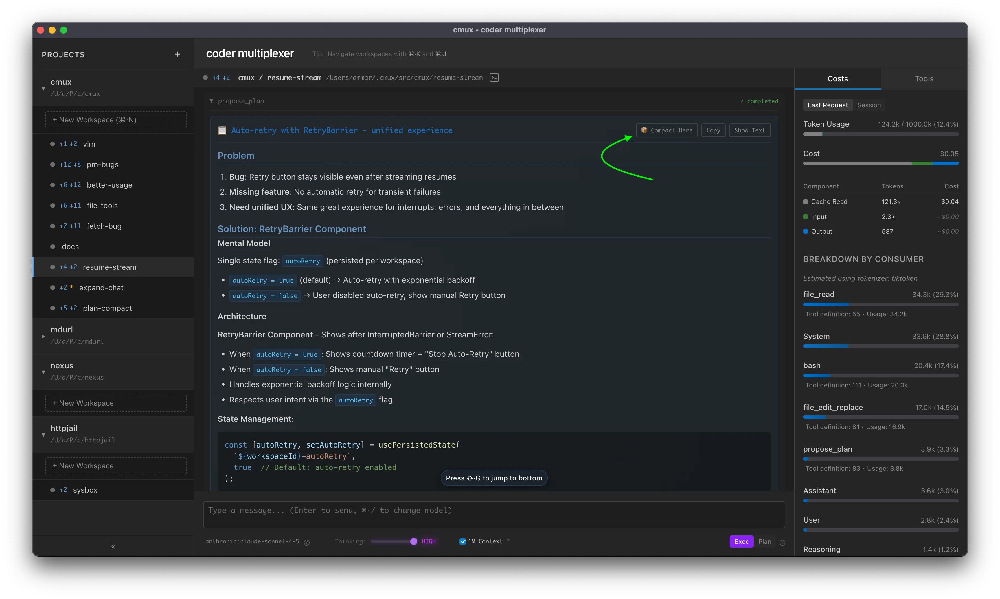

# Context Management

Commands for managing conversation history length and token usage.

## Comparison

| Approach                 | `/clear` | `/truncate` | `/compact`       | Start Here  |
| ------------------------ | -------- | ----------- | ---------------- | ----------- |
| **Speed**                | Instant  | Instant     | Slower (uses AI) | Instant     |
| **Context Preservation** | None     | Temporal    | Intelligent      | Intelligent |
| **Cost**                 | Free     | Free        | Uses API tokens  | Free        |
| **Reversible**           | No       | No          | No               | Yes         |

## Start Here

Start Here allows you to restart your conversation from a specific point, using that message as the entire conversation history. This is available on:

- **Plans** - Click "🎯 Start Here" on any plan to use it as your conversation starting point
- **Final Assistant messages** - Click "🎯 Start Here" on any completed assistant response



This is a form of "opportunistic compaction" - the content is already well-structured, so the operation is instant. You can review the new starting point before the old context is permanently removed, making this the only reversible context management approach (use Cmd+Z/Ctrl+Z to undo).

## `/clear` - Clear All History

Remove all messages from conversation history.

### Syntax

```
/clear
```

### Notes

- Instant deletion of all messages
- **Irreversible** - all history is permanently removed
- Use when you want to start a completely new conversation

---

## `/compact` - AI Summarization

Compress conversation history using AI summarization. Replaces the conversation with a compact summary that preserves context.

### Syntax

```
/compact [-t <tokens>] [-c <message>]
```

### Options

- `-t <tokens>` - Maximum output tokens for the summary (default: ~2000 words)
- `-c <message>` - Continue after compaction with this user message (persists across restarts)

### Examples

```
/compact
```

Basic compaction with defaults.

```
/compact -t 5000
```

Limit summary to ~5000 tokens.

```
/compact -c "Continue implementing the auth system"
```

Compact and auto-continue with custom prompt. The continue message is stored and reused on future compactions.

```
/compact -t 3000 -c "Keep going"
```

Combine token limit and auto-continue.

### Notes

- Uses the selected LLM to summarize conversation history
- Preserves actionable context and specific details
- **Irreversible** - original messages are replaced
- Continue message persists in localStorage until changed

---

## `/truncate` - Simple Truncation

Remove a percentage of messages from conversation history (from the oldest first).

### Syntax

```
/truncate <percentage>
```

### Parameters

- `percentage` (required) - Percentage of messages to remove (0-100)

### Examples

```
/truncate 50
```

Remove oldest 50% of messages.

### Notes

- Simple deletion, no AI involved
- Removes messages from oldest to newest
- About as fast as `/clear`
- `/truncate 100` is equivalent to `/clear`
- **Irreversible** - messages are permanently removed

### OpenAI Responses API Limitation

⚠️ **`/truncate` does not work with OpenAI models** due to the Responses API architecture:

- OpenAI's Responses API stores conversation state server-side
- Manual message deletion via `/truncate` doesn't affect the server-side state
- Instead, OpenAI models use **automatic truncation** (`truncation: "auto"`)
- When context exceeds the limit, the API automatically drops messages from the middle of the conversation

**Workarounds for OpenAI:**

- Use `/clear` to start a fresh conversation
- Use `/compact` to intelligently summarize and reduce context
- Rely on automatic truncation (enabled by default)
