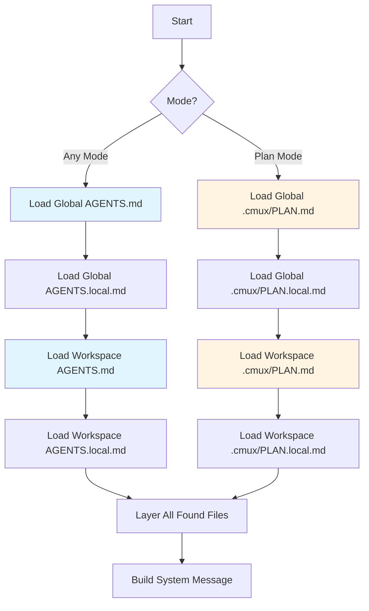

# Instruction Files

## Instruction Files

cmux loads instructions from both global and workspace locations, layering them together:

1. `~/.cmux/AGENTS.md` (+ `AGENTS.local.md`) - Global defaults
2. `<workspace>/AGENTS.md` (+ `AGENTS.local.md`) - Project-specific

**Priority:** `AGENTS.md` → `AGENT.md` → `CLAUDE.md` (first found)

**Local variants:** Add personal preferences to `AGENTS.local.md` and `.gitignore` it.

## Plan Files (Plan Mode Only)

When in **Plan mode**, cmux includes `.cmux/PLAN.md` to guide planning behavior. Plan files layer the same as instruction files:

1. `~/.cmux/.cmux/PLAN.md` (+ `PLAN.local.md`) - Global plan behavior
2. `<workspace>/.cmux/PLAN.md` (+ `PLAN.local.md`) - Workspace-specific plan behavior

## Loading Behavior



All files are optional. If a file doesn't exist, it's skipped. Files layer together - they don't override each other.

## Example Structure

```
~/.cmux/
  AGENTS.md          # Global preferences
  AGENTS.local.md    # Personal overrides (gitignored)
  .cmux/
    PLAN.md          # Global plan mode behavior
    PLAN.local.md    # Personal plan tweaks (gitignored)

my-project/
  AGENTS.md          # Project guidelines
  AGENTS.local.md    # Local notes (gitignored)
  .cmux/
    PLAN.md          # Project-specific plan mode behavior
    PLAN.local.md    # Local plan notes (gitignored)
```
