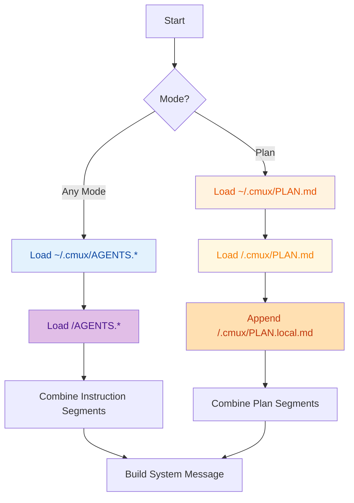

# Instruction Files

## Instruction Files

cmux layers instructions from two locations:

1. `~/.cmux/AGENTS.md` (+ optional `AGENTS.local.md`) — global defaults
2. `<workspace>/AGENTS.md` (+ optional `AGENTS.local.md`) — workspace-specific context

**Priority:** `AGENTS.md` → `AGENT.md` → `CLAUDE.md` (first match wins per directory)

## Plan Files (Plan Mode Only)

Plan mode adds `.cmux/PLAN.md` files to influence planning behavior. The search order mirrors instruction layering:

1. `~/.cmux/PLAN.md`
2. `<workspace>/.cmux/PLAN.md` (+ optional `PLAN.local.md`)

## Loading Flow



Missing files are simply skipped; nothing overrides previously loaded content.

## Example Layout

```
~/.cmux/
  AGENTS.md          # Global prompts
  PLAN.md            # Global plan guidance (optional)

my-project/
  AGENTS.md          # Project prompts
  AGENTS.local.md    # Local overrides (gitignored)
  .cmux/
    PLAN.md          # Project plan behavior
    PLAN.local.md    # Local plan tweaks (gitignored)
```
