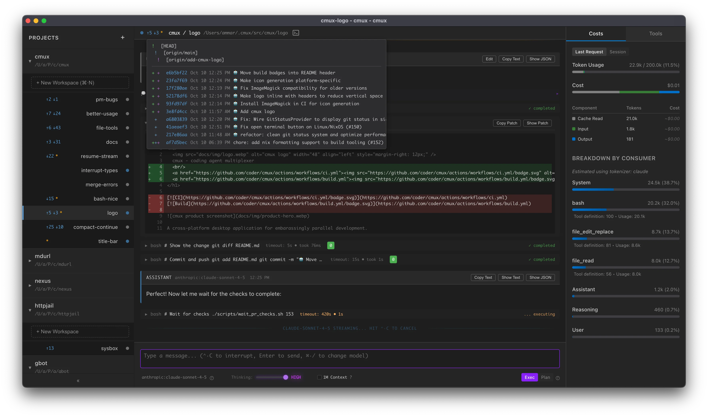

# Introduction

**cmux** (Coding Agent Multiplexer) is a cross-platform desktop application for AI-assisted development with git worktree integration.

## What is cmux?

cmux helps you work with AI coding assistants more effectively by:

- 🔀 **Git Worktree Integration** - Work on multiple branches simultaneously
- 🤖 **Multiple Permission Modes** - Control how aggressively the AI can modify your code (plan/exec)
- 📦 **Project Management** - Organize and switch between multiple projects seamlessly
- 💬 **Session History** - Full chat history persistence across sessions
- 🔄 **Flexible Workflows** - Support for different AI models and providers

## Quick Links

- [Install](./install.md) - Download and installation instructions
- [Why Parallelize?](./why-parallelize.md) - Why parallelize?
- [Keyboard Shortcuts](./keybinds.md) - Complete keyboard reference
- [AGENTS](./AGENTS.md) - Developer guide for AI assistants

## License

cmux is licensed under the [GNU Affero General Public License v3.0 (AGPL-3.0)](https://github.com/coder/cmux/blob/main/LICENSE).

Copyright (C) 2025 Coder Technologies, Inc.
