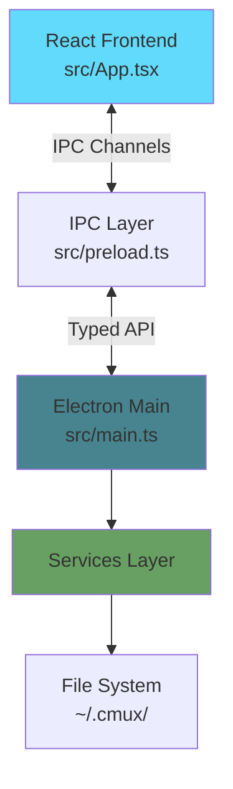
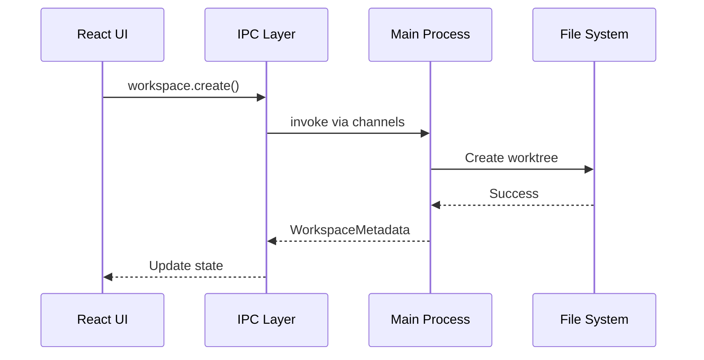

# Architecture

cmux is built with a clear separation between the main process (backend) and renderer process (frontend).

## High-Level Architecture



## Key Components

### Frontend (Renderer Process)

- **React UI** - Built with TypeScript and React
- **State Management** - React hooks and context
- **IPC Client** - Type-safe API calls via preload script

### Backend (Main Process)

- **Electron Main** - Window management and lifecycle
- **Services** - Business logic (WorkspaceService, HistoryService, etc.)
- **Configuration** - JSON-based config management

### IPC Layer

Provides type-safe communication between frontend and backend:

```typescript
window.api.workspace.create(projectPath, branchName)
window.api.history.get(workspaceId)
```

## Data Flow



## Project Structure

- `src/main.ts` - Main Electron process
- `src/preload.ts` - Preload script for IPC
- `src/App.tsx` - Main React component
- `src/config.ts` - Configuration management
- `~/.cmux/` - User data directory
  - `config.json` - User configuration
  - `src/<project>/<branch>/` - Git worktrees
  - `sessions/<workspace_id>/chat.jsonl` - Chat history
