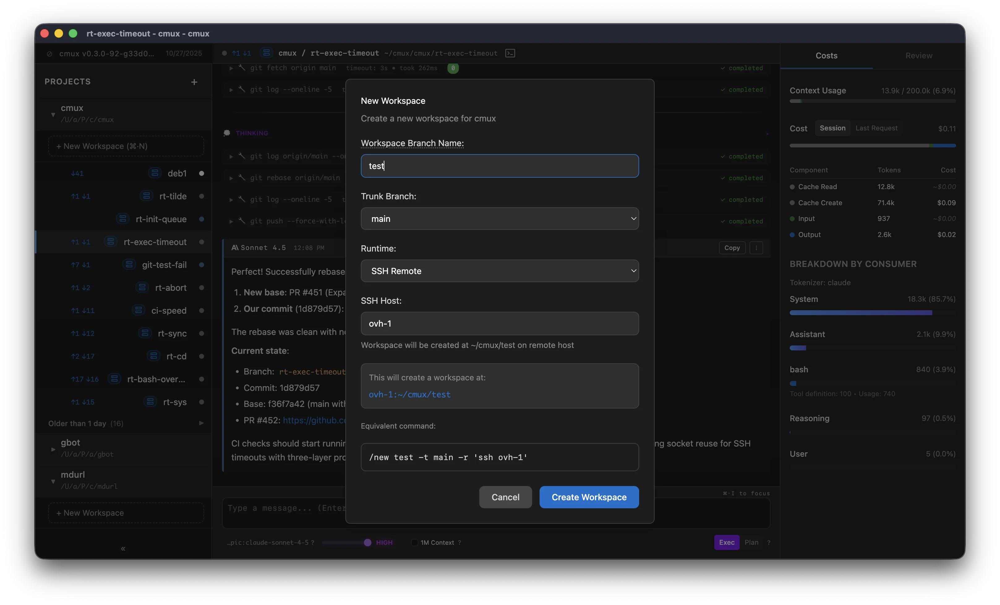

# SSH Workspaces

cmux supports using an SSH remote to run workspaces. When configured, all tool operations will
execute over SSH and the agent is securely isolated from your local machine.

We highly recommend using SSH workspaces for an optimal agentic experience:

- **Security**: Prompt injection risk is contained to the credentials / files on the remote machine.
- **Performance**: Run many, many agents in parallel while maintaining good battery life and UI performance



The Host can be:

- a hostname (e.g. `my-server.com`)
- a username and hostname (e.g. `user@my-server.com`)
- an alias from your `~/.ssh/config`, e.g. `my-server`

In fact, we delegate SSH configuration to the system's `ssh` command, so can set up advanced
configuration for your agentic machine in your local `~/.ssh/config` file.

Here's an example of an alias:

```
Host ovh-1
	HostName 148.113.1.1
	User root
```

## Authentication

> **Note**: As we delegate to `ssh`, this is really an abbreviated reference of how `ssh` authenticates.

There are a few practical ways to set up authentication.

### Local defaults

Ensure your private key is one of these locations:

```
~/.ssh/id_rsa
~/.ssh/id_ecdsa
~/.ssh/id_ecdsa_sk
~/.ssh/id_ed25519
~/.ssh/id_ed25519_sk
```

### SSH Agent

If you have an SSH agent running, you can use it to authenticate.

```
ssh-add ~/.ssh/id_rsa
```

### Config

You can also configure authentication in your `~/.ssh/config` file.

```
Host my-server
	HostName 148.113.1.1
	User root
	IdentityFile ~/.ssh/id_rsa
```

## Coder Workspaces

If you're using [Coder Workspaces](https://coder.com/docs), you can leverage your existing Workspace
with cmux:

1. Run `coder config-ssh`
2. Use `coder.<workspace-name>` as your SSH host when creating a new cmux workspace

Note that in this approach we're multiplexing agents onto a single Coder Workspace, not creating
a new workspace per agent. This avoids the workspace creation overhead for rapid muxing,
while still isolating the agent from your local machine.
