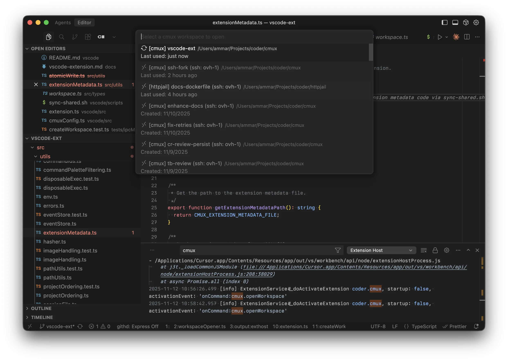

# VS Code Extension

The cmux VS Code extension allows you to quickly jump into your cmux workspaces directly from Visual Studio Code or Cursor. This enables a more seamless back and forth between a purely agentic workflow and traditional editing. It's
especially useful for completing the "last mile" of a task or establishing the initial architecture.



## Overview

Instead of switching between cmux and your editor, you can open any cmux workspace from the Command Palette:

1. Press `Cmd+Shift+P` (or `Ctrl+Shift+P` on Windows/Linux)
2. Type "cmux: Open Workspace"
3. Select your workspace
4. It opens in a new editor window

The extension works seamlessly with both local and SSH workspaces. It's compatible with VS Code and Cursor (or any VS Code-based editor).

## Installation

### Download

Download the latest `.vsix` file from the [GitHub releases page](https://github.com/coder/cmux/releases).

### Install

**Command line:**

```bash
# For VS Code
code --install-extension cmux-*.vsix

# For Cursor
cursor --install-extension cmux-*.vsix
```

**From editor UI:**

1. Open Command Palette (`Cmd+Shift+P`)
2. Type "Extensions: Install from VSIX..."
3. Select the downloaded file

## Usage

### Opening a Workspace

**Command Palette**:

1. Press `Cmd+Shift+P` → "cmux: Open Workspace"
2. Select from list: Choose your workspace
3. Opens automatically: New editor window with the workspace

**Custom Keyboard Shortcut** (optional):

- Open Keyboard Shortcuts settings (`Cmd+K Cmd+S`)
- Search for "cmux: Open Workspace"
- Set your preferred keybinding (suggestions: `Cmd+K Cmd+M` or `Cmd+O Cmd+M`)

### Workspace Types

The extension displays workspaces differently based on their type:

- **Local**: `📁 [project-name] workspace-name`
- **SSH**: `🔗 [project-name] workspace-name (ssh: hostname)`

## SSH Workspaces

### Requirements

For SSH workspaces to work, you need:

1. **Remote-SSH Extension** installed
   - VS Code: `ms-vscode-remote.remote-ssh`
   - Cursor: `anysphere.remote-ssh`
   - The extension automatically detects which one you have
2. **SSH host configured** in `~/.ssh/config` or in the Remote-SSH extension

### Setup SSH Host

If you haven't configured the SSH host yet:

1. Open `~/.ssh/config` and add:

   ```ssh
   Host myserver
     HostName 192.168.1.100
     User username
     IdentityFile ~/.ssh/id_rsa
   ```

2. Or use VS Code's Remote-SSH command:
   - `Cmd+Shift+P` → "Remote-SSH: Add New SSH Host..."

## Development

For development instructions, see `vscode/README.md` and `vscode/DEVELOPMENT.md` in the
repository.

## Related

- [Workspaces Overview](./workspaces.md)
- [SSH Workspaces](./ssh.md)
- [VS Code Remote-SSH Documentation](https://code.visualstudio.com/docs/remote/ssh)
